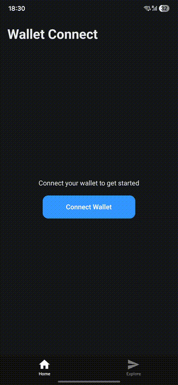

# Wallet Connect - Multi-Chain Crypto Wallet App

A React Native (Expo) mobile app that connects to MetaMask via WalletConnect, fetches balances across multiple EVM chains, shows live USD prices, and sends transactions.

## Demo



## Features

- Connect to MetaMask (and other wallets) via WalletConnect
- View connected accounts across multiple EVM chains
- Fetch native + ERC-20 token balances using Alchemy
- Live USD market prices via CoinGecko
- Send ETH transactions signed by the wallet

## Tech Stack

| Library | Purpose |
|---------|---------|
| Expo (v54) | React Native framework |
| Reown AppKit | WalletConnect integration |
| Ethers Adapter | EVM blockchain provider |
| MMKV | Session persistence |
| Alchemy API | Blockchain data (balances, metadata) |
| CoinGecko API | Market prices (USD) |

## Supported Chains

**Mainnets:** Ethereum, Polygon, Arbitrum, Optimism, Base, BNB Smart Chain, Linea

**Testnets:** Sepolia, Polygon Amoy, Arbitrum Sepolia, Base Sepolia, Optimism Sepolia

## Getting Started

1. Install dependencies

   ```bash
   npm install
   ```

2. Set up API keys in:
   - `config/appkit.ts` — Reown Project ID from [cloud.reown.com](https://cloud.reown.com)
   - `services/alchemy.ts` — Alchemy API key from [dashboard.alchemy.com](https://dashboard.alchemy.com)
   - `services/coingecko.ts` — CoinGecko API key from [coingecko.com/en/api](https://www.coingecko.com/en/api)

3. Prebuild and run

   ```bash
   npx expo prebuild
   npx expo run:ios
   # or
   npx expo run:android
   ```

> Requires a dev client build since this uses native modules (MMKV, WalletConnect).

## Documentation

See [ARTICLE.md](ARTICLE.md) for a detailed technical walkthrough of how everything works.
